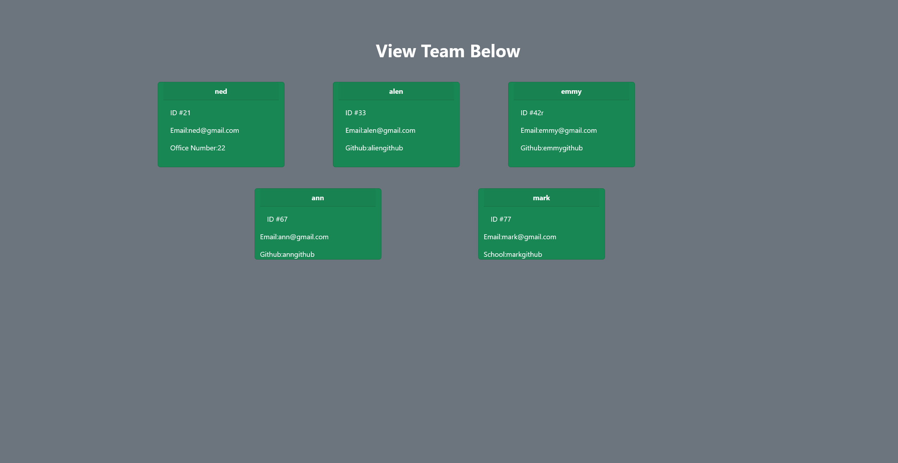
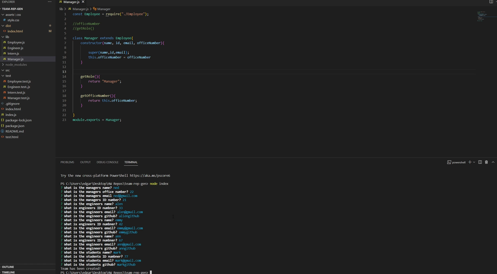

# team-rep-gen

## Description
As a manager list out your teams info into inqueirer console and it will auto generate a HTML page that displays your teams name ID number and a few other things! 

See a HTML page get created here: https://youtu.be/mJPAUM7uS0w

## Installation

Please git clone the repo , and run npm i to install the dependencies. To generate a page do "node index" in the terminal and fill out all the questions.

## App in use

### HTML page

### Node questions
